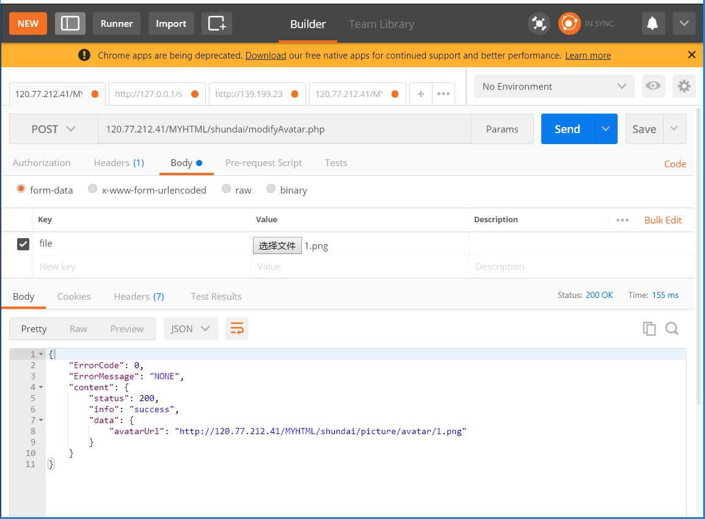

# 后台代码

## demo 待完成

#                  基本功能

### 0、注册

请求地址：http://120.77.212.41/MYHTML/shundaiLevelUP/register.php
==========================================================

请求格式：
```json
{
	"Type":0,
	"Content":{
		"username":"不透明",
		"password":"123467"
	}
}
```
返回格式：
```json
{
    "ErrorCode": 0,
    "ErrorMessage": "NONE",
    "content": {
        "status": 200,
        "info": "success",
        "data": "注册成功啦!!"
    }
}
```


请求地址：http://120.77.212.41/MYHTML/shundaiLevelUP/getInformation.php
==========================================================


### 1、登陆

请求格式：
```json
{
        "Type":0,
    "Content": {
        "Account":"老大",
        "Password":"123456"
    }
}
```
返回格式：
```json
{
    "ErrorCode": 0,
    "ErrorMessage": "NONE",
    "content": {
        "status": 200,
        "info": "success",
        "data": {
            "id": "1",
            "username": "张中豪",
			"nickname": "夜曲",
            "password": "123456",
            "avatar": "http://120.77.212.41/MYHTML/shundaiLevelUP/picture/avatar/1.png",
            "phonenumber": "56481651",
            "sex": "1",
            "birthday": "1997-11-2",
            "school": "CQUPT",
            "qqnumber": "1070042265",
            "alipay": "18883649890",
            "token": "sfdghggfdsadfg"
        }
    }
}

```
### 2、请求用户快递列表

请求格式：
```json
{
	"Type":1,
    "Content": {
        "Account":"老大"  //账户名，请求名为 老大 的快递列表
    }
}
```
返回格式：
```json
{
    "ErrorCode": 0,
    "ErrorMessage": "NONE",
    "content": {
        "status": 200,
        "info": "success",
        "data": [
            {
                "deliverid": "5",
                "username": "老大",
                "prcie": "22元",
                "remark": null,
                "delivertype": "韵达快递",
                "receivetime": "9:00-12:00",
                "phonenumber": "46845345215",
                "sendlocation": "重邮五栋"
            },
            {
                "deliverid": "10",
                "username": "老大",
                "prcie": "22元",
                "remark": null,
                "delivertype": "韵达快递",
                "receivetime": "9:00-12:00",
                "phonenumber": "46845345215",
                "sendlocation": "重邮五栋"
            }
        ]
    }
}


```

### 3、请求所有的快递列表

请求格式：
```json
{
	"Type":5,
    "Content": {
    	"page":1,  
    	"count":2 
    }
}
```
返回格式：
```json
{
    "ErrorCode": 0,
    "ErrorMessage": "NONE",
    "content": {
        "status": 200,
        "info": "success",
        "data": [
            {
                "expressid": 2,
                "username": "张中豪",
                "nickname": "夜曲",
                "avatar": "http://127.0.0.1/shundaiLevelUP/picture/avatar/1.png",
                "deliverstatus": 0,
                "delivertype": "顺丰快递",
                "receivetime": "8:00-9:00",
                "sendlocation": "重邮15栋"
            },
            {
                "expressid": 4,
                "username": "张中豪",
                "nickname": "夜曲",
                "avatar": "http://127.0.0.1/shundaiLevelUP/picture/avatar/1.png",
                "deliverstatus": 0,
                "delivertype": "圆通快递",
                "receivetime": "9:00-12:00",
                "sendlocation": "重邮五栋"
            }
        ]
    }
}
```

### 4、请求快递详细信息

请求格式：
```json
{
	"Type":2, 
    "Content": {
        "deliverid":2 
    }
}
```


返回格式：
```json
{
    "ErrorCode": 0,
    "ErrorMessage": "NONE",
    "content": {
        "status": 200,
        "info": "success",
        "data": [
            {
                "deliverid": 2,
                "deliverstatus": 0,
                "avatar": null,
                "delivertype": "顺丰快递",
                "receivetime": "8:00-9:00",
                "sendlocation": "重邮15栋",
                "note": null,
                "repay": "30元",
                "username": "张中豪",
				"nickname": "夜曲",
                "phonenumber": "18883649890",
                "sex": 1,
                "token": null
            }
        ]
    }
}
```

### 5、请求用户二手商品列表

请求格式：
```json
{
	"Type":6,
    "Content": {
        "Account":"张中豪"
    }
}
```

返回格式：
```json
{
    "ErrorCode": 0,
    "ErrorMessage": "NONE",
    "content": {
        "status": 200,
        "info": "success",
        "data": [
            {
                "goodsid": 1,
                "title": "我是一本书",
                "avatar": "http://127.0.0.1/shundaiLevelUP/picture/avatar/1.png",
                "username": "张中豪",
                "nickname": "夜曲",
                "image": "http://127.0.0.1/shundaiLevelUP/picture/image/1.png",
                "printtime": "2018年5月1日",
                "phonenumber": "17784451850",
                "price": "88元",
                "recommended": null
            },
            {
                "goodsid": 6,
                "title": "震惊",
                "avatar": "http://127.0.0.1/shundaiLevelUP/picture/avatar/1.png",
                "username": "张中豪",
                "nickname": "夜曲",
                "image": "http://127.0.0.1/shundaiLevelUP/picture/image/default.png",
                "printtime": "2018年5月1日",
                "phonenumber": "5468452",
                "price": "86元",
                "recommended": null
            }
        ]
    }
}
```

### 6、请求所有二手商品列表

请求格式：
```json
{
	"Type":3,
    "Content": {
    	"page":1,  //你要请求的页数
    	"count":5  //请求的条数
    }
}
```

返回格式：
```json
{
    "ErrorCode": 0,
    "ErrorMessage": "NONE",
    "content": {
        "status": 200,
        "info": "success",
        "data": [
            {
                "goodsid": 1,
                "title": "我是一本书",
                "image": null,
                "price": "88元"
            },
            {
                "goodsid": 3,
                "title": "没有标题",
                "image": null,
                "price": "66元"
            },
            {
                "goodsid": 4,
                "title": "有标题了",
                "image": null,
                "price": "76元"
            },
            {
                "goodsid": 5,
                "title": "还是没有标题",
                "image": null,
                "price": "81元"
            },
            {
                "goodsid": 6,
                "title": "震惊",
                "image": null,
                "price": "86元"
            }
        ]
    }
}
```


### 7、请求二手详细信息


请求格式：
```json
{
	"Type":4,
    "Content": {
    	"goodsid":1
    }
}
```
返回格式：
```json
{
    "ErrorCode": 0,
    "ErrorMessage": "NONE",
    "content": {
        "status": 200,
        "info": "success",
        "data": [
            {
                "goodsid": 1,
                "title": "我是一本书",
                "avatar": null,
                "username": "张中豪",
				"nickname": "夜曲",
                "image": null,
                "token": null,
                "publishtime": "2015年11月15日",
                "publishid": 1,
                "page": 200,
                "words": "10000字",
                "printtime": "2018年5月1日",
                "format": 1,
                "paper": "胶版纸",
                "printtimes": 1,
                "package": "平装",
                "isbn": "488564132168",
                "price": "88元",
                "recommended": null
            }
        ]
    }
}
```

请求地址：http://120.77.212.41/MYHTML/shundaiLevelUP/modify/modifyAvatar.php
============================================================

### 8、修改用户头像

请求格式:
上传png图片
图片名称为 你要修改头像用户的 "id "+ ".png "


如上图所示为修改id为1的用户的头像为1.png

返回格式：
```json
{
    "ErrorCode": 0,
    "ErrorMessage": "NONE",
    "content": {
        "status": 200,
        "info": "success",
        "data": {
            "avatarUrl": "http://120.77.212.41/MYHTML/shundaiLevelUP/picture/avatar/2.png"
        }
    }
}
```


请求地址：http://120.77.212.41/MYHTML/shundaiLevelUP/add/addExpress.php
==========================================================

### 9、增加快递信息

请求格式：
```json
{
	"Type":0,
	"Content":{
		"uid":6,
		"deliverstatus":1,
		"repay":"10元",
		"phonenumber":"1865485625253",
		"delivertype":"顺丰",
		"receivetime":"五月十八日8：00--9：00",
		"sendlocation":"重邮28栋",
		"note":"快一点哦！大哥！"
	}
}
```

返回格式：
```json
{
    "ErrorCode": 0,
    "ErrorMessage": "NONE",
    "content": {
        "status": 200,
        "info": "success",
        "data": "添加成功"
    }
}
```

请求地址：http://120.77.212.41/MYHTML/shundaiLevelUP/add/addSecondHand.php
==========================================================

### 10、添加二手商品

请求格式：
```json
{
	"Type":0,
	"Content":{
		"uid":6,
		"title":"标题好难想啊",
		"price":"10元",
		"publishid":18,
		"publishtime":"2016年9月10日",
		"page":255,
		"phonenumber":"9090980",
		"words":"1000字",
		"paper":"胶版纸",
		"format":2,
		"printtime":"2016年10月10日",
		"package":"土豪版",
		"printtimes":5,
		"isbn":"4145861216",
		"recommended":"这本苏写的是真的好哦！看完高数一百分！"
	}
}
```
返回格式：
```json
{
    "ErrorCode": 0,
    "ErrorMessage": "NONE",
    "content": {
        "status": 200,
        "info": "success",
        "data": {
            "id": 11
        }
    }
}
```

请求地址：http://120.77.212.41/MYHTML/shundaiLevelUP/modify/modifyImage.php
============================================================

### 11、修改二手商品的图片

请求格式:
上传png图片
图片名称为 你要修改商品的 "id "+ ".png "


如上图所示为修改id为1的商品为1.png

返回格式：
```json
{
    "ErrorCode": 0,
    "ErrorMessage": "NONE",
    "content": {
        "status": 200,
        "info": "success",
        "data": {
            "imageUrl": "http://120.77.212.41/MYHTML/shundaiLevelUP/picture/image/1.png"
        }
    }
}
```

请求地址：http://120.77.212.41/MYHTML/shundaiLevelUP/delete/deleteExpress.php
============================================================

### 12、删除快递

请求格式：
```json
{
	"Type":0,
	"Content":{
		"id":6
	}
}
```

返回格式：
```json
{
    "ErrorCode": 0,
    "ErrorMessage": "NONE",
    "content": {
        "status": 200,
        "info": "success",
        "data": "删除成功"
    }
}
```


请求地址：http://120.77.212.41/MYHTML/shundaiLevelUP/delete/deleteSecondHand.php
============================================================

### 13、删除商品

请求格式：
```json
{
	"Type":0,
	"Content":{
		"id":6
	}
}
```

返回格式：
```json
{
    "ErrorCode": 0,
    "ErrorMessage": "NONE",
    "content": {
        "status": 200,
        "info": "success",
        "data": "删除成功"
    }
}
```

请求地址：http://120.77.212.41/MYHTML/shundaiLevelUP/modify/modifyUserInformation.php
=======================================================================

### 14、修改个人信息

请求格式：
```json
{
        "Type":0,
    "Content": {
        "username":"张中豪",
        "password":"123456",
		"nickname": "夜曲",
		"phonenumber":"9090900",
		"sex":1,
        "birthday":"1888-5-28",
        "school":"TPUQC",
        "qqnumber":"1270246920",
        "alipay":"17784451850"
    }
}
```
返回格式：
```json
{
    "ErrorCode": 0,
    "ErrorMessage": "NONE",
    "content": {
        "status": 200,
        "info": "success",
        "data": "修改个人信息成功"
    }
}
```


请求地址：http://120.77.212.41/MYHTML/shundaiLevelUP/modify/modifyExpressStatus.php
=================================================================

### 15、修改快递状态

请求格式：
```json
{
	"Type":0,
	"Content":{
		"id":2,
		"status":2
	}
}
```

返回格式：
```json
{
    "ErrorCode": 0,
    "ErrorMessage": "NONE",
    "content": {
        "status": 200,
        "info": "success",
        "data": "修改快递状态成功"
    }
}
```

#                       表白墙

请求地址：http://120.77.212.41/MYHTML/shundaiLevelUP/SayYourLove/addLoveRequest.php

1、	添加告白

请求格式：
```json
{
	"Type":0,
	"Content":{
		"uid":1,
		"title":"我喜欢你",
		"content":"when ever shall we meet again"
	}
}
```
返回格式：
```json
{
    "ErrorCode": 0,
    "ErrorMessage": "NONE",
    "content": {
        "status": 200,
        "info": "success",
        "data": "添加成功"
    }
}
```

请求地址：http://120.77.212.41/MYHTML/shundaiLevelUP/SayYourLove/addComment.php

2、	添加评论

请求格式：
```json
{
	"Type":0,
	"Content":{
		"uid":2,
		"qid":3,
		"content":"祝你成功"
	}
}
```
返回格式：
```json
{
    "ErrorCode": 0,
    "ErrorMessage": "NONE",
    "content": {
        "status": 200,
        "info": "success",
        "data": "添加成功"
    }
}
```
请求地址：http://120.77.212.41/MYHTML/shundaiLevelUP/SayYourLove/getLoveWallList.php

3、	请求告白列表

请求格式：
```json
{
	"Type":0,
    "Content": {
    	"page":1,  
    	"count":2
    }
}
```
返回格式：
```json
{
    "ErrorCode": 0,
    "ErrorMessage": "NONE",
    "content": {
        "status": 200,
        "info": "success",
        "data": [
            {
                "loveid": 1,
                "title": "爱你一万年",
                "content": "以后你是我老大"
            },
            {
                "loveid": 3,
                "title": "好了好了",
                "content": "I want you"
            }
        ]
    }
}
```
请求地址：http://120.77.212.41/MYHTML/shundaiLevelUP/SayYourLove/getComments.php

4、	请求评论列表

请求格式：
```json
{
	"Type":0,
    "Content": {
    	"qid":4
    }
}
```
返回格式：
```json
{
    "ErrorCode": 0,
    "ErrorMessage": "NONE",
    "content": {
        "status": 200,
        "info": "success",
        "data": [
            {
                "username": "张中豪",
                "nickname": "夜$曲",
                "content": "I wangted you to be there when I fall",
                "time": "2018-06-01 19:49:05"
            },
            {
                "username": "老大",
                "nickname": null,
                "content": "祝你成功",
                "time": "2018-06-01 21:02:06"
            },
            {
                "username": "张中豪",
                "nickname": "夜$曲",
                "content": "I really love you",
                "time": "2018-06-01 21:15:13"
            }
        ]
    }
}
```
